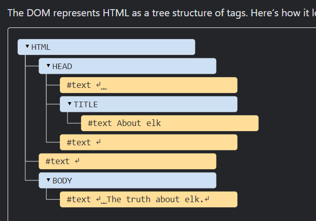

  


# DOM (Document Object Model)

The Document Object Model, or DOM for short, represents all page content as objects that can be modified.

The document object is the main “entry point” to the page. We can change or create anything on the page using it.


## DOM tree
The backbone of an HTML document is tags.

According to the Document Object Model (DOM), every HTML tag is an object. Nested tags are “children” of the enclosing one. The text inside a tag is an object as well.

All these objects are accessible using JavaScript, and we can use them to modify the page.

```
(documnent.body)

is the object representing the <body>

document.body.style.background = "blue"; 

// makes background blue .

setTimeout(()=>document.body.style.background ='',3000);
```

## DOM TREE STRUCTURE
```
<!DOCTYPE HTML>
<html>
<head>
  <title>About elk</title>
</head>
<body>
  The truth about elk.
</body>
</html>

```

How it looks :-



IN JS ATTRIBUTES MEANS CLASS AND ID .

```
changing background color using style in js .
title.style.backgroundColor = "colorname" .
title.style.padding = "xpx" // this will provide the padding of given in our  site .

```

```

1.title.textContent // here title is class name and this will help in finding content inside the our class .


2.title.innerHTML  // this will only display the content inside the html tag and displays all value including the html written inside the tag .


3.title.innerText // this will display the text which is hidden  by using css properties.


```


1. document.getElementById('name of the id');
2. document.getElementById('').getAttributes.
3. document.getElementById('').getAttributes.
4. title.style.padding = '45px' // can give padding to the object .
5. idname.textcontent // will provide me content  written inside .
6. difference in innerHTML / innerText/ textcontent
7. document.querySelectorAll();
8. document.querySelectorAll() provides us the detil of the elements in the form of nodelist not full array but with some properties of the array but   by using Array.From(name) we can use all propertires of the array.

9. const name = document.querySelector(nameofclass);     name.children will provide us the html collection of the class parent and  now we can iterate through the html using for loop and index as html colllection uses somewhat similar to array.


10. htmlcollection.firstelementchild  


 


// above command will provide us  the id element needed .